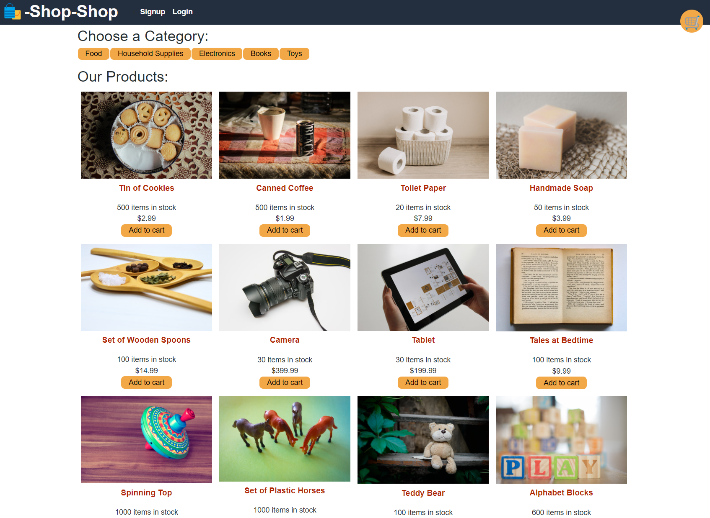
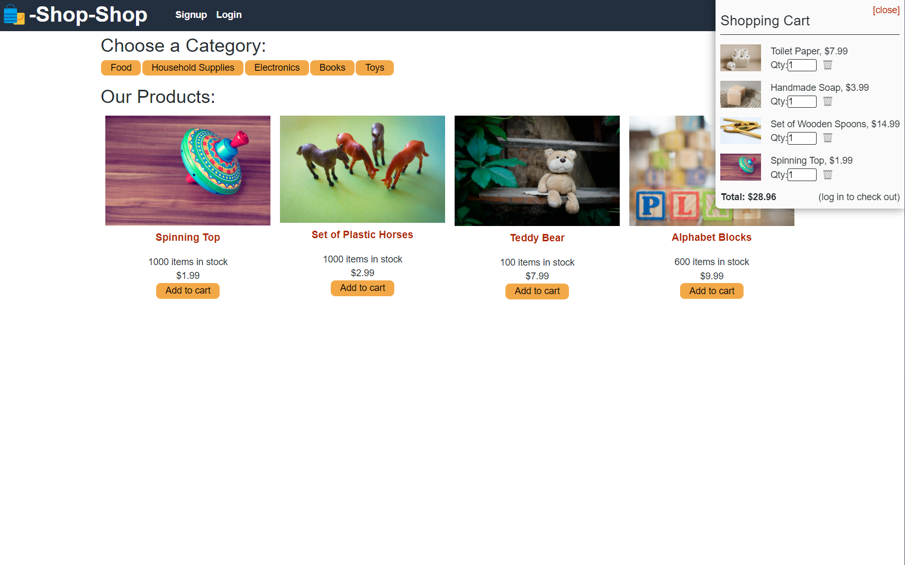

# redux-e-commerce-store

A redux e-commerce store

## Description

A redux e-commerce store, this was an existing MERN e-commerce shopping store that was using the React Context API. In this project it was converted to use Redux instead of Context API and Provider Redux with React Redux along with Dispatch and State. The app allows users to add and or remove items to the shopping cart and checkout. To be able to checkout the user must sign in or sign up to do so. For the cart checkout it is using Stripe in test mode.

## Screenshot(s)

## Link to deployed App

[Link to deployed app](https://stormy-atoll-16065.herokuapp.com/)
